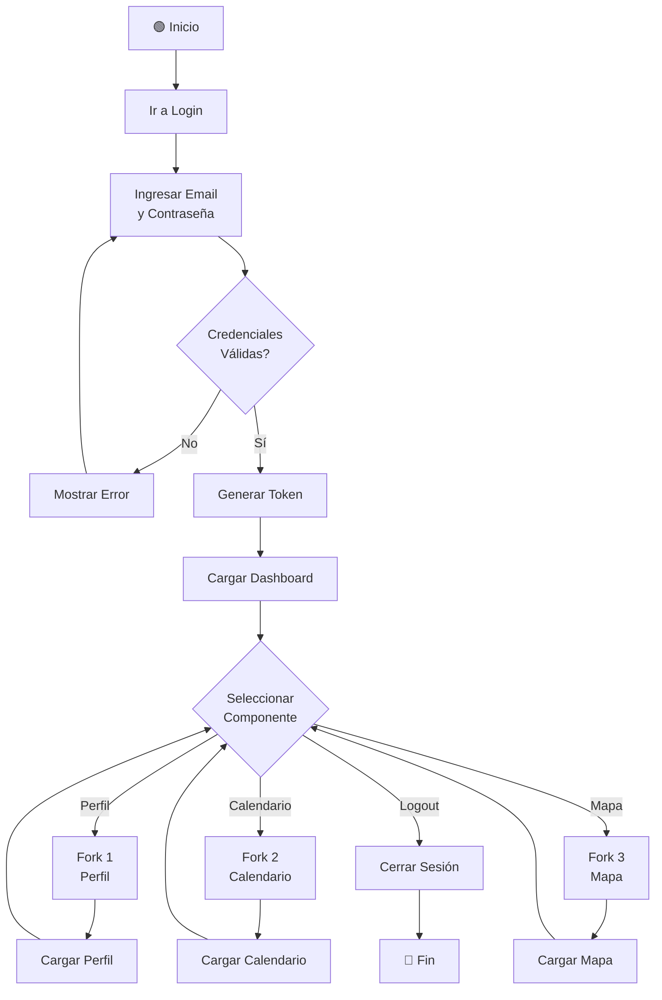

# Diagrama de Actividades Mejorado

```mermaid
graph TD
    A[🟢 Inicio]
    B["Ir a Login"]
    C["Ingresar Email<br/>y Contraseña"]
    D{"Credenciales<br/>Válidas?"}
    E["Mostrar Error"]
    F["Generar Token"]
    G["Cargar Dashboard"]
    H{"Seleccionar<br/>Componente"}
    I["Cargar Perfil"]
    J["Cargar Calendario"]
    K["Cargar Mapa"]
    M["Cerrar Sesión"]
    N["Fork 1<br/>Perfil"]
    O["Fork 2<br/>Calendario"]
    P["Fork 3<br/>Mapa"]
    S["🔴 Fin"]
    
    A --> B
    B --> C
    C --> D
    D -->|No| E
    E --> C
    D -->|Sí| F
    F --> G
    G --> H
    
    H -->|Perfil| N
    H -->|Calendario| O
    H -->|Mapa| P
    H -->|Logout| M
    
    N --> I
    O --> J
    P --> K
    
    I --> H
    J --> H
    K --> H
    
    M --> S
```
