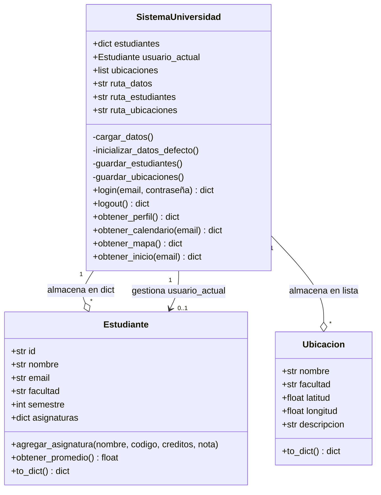

# Diagrama de Actividades Mejorado

```mermaid
classDiagram
    class Estudiante {
        +str id
        +str nombre
        +str email
        +str facultad
        +int semestre
        +dict asignaturas
        +agregar_asignatura(nombre, codigo, creditos, nota)
        +obtener_promedio() float
        +to_dict() dict
    }

    class Ubicacion {
        +str nombre
        +str facultad
        +float latitud
        +float longitud
        +str descripcion
        +to_dict() dict
    }

    class SistemaUniversidad {
        +dict estudiantes
        +Estudiante usuario_actual
        +list ubicaciones
        +str ruta_datos
        +str ruta_estudiantes
        +str ruta_ubicaciones
        -cargar_datos()
        -inicializar_datos_defecto()
        -guardar_estudiantes()
        -guardar_ubicaciones()
        +login(email, contraseña) dict
        +logout() dict
        +obtener_perfil() dict
        +obtener_calendario(email) dict
        +obtener_mapa() dict
        +obtener_inicio(email) dict
    }

    %% Relaciones exactas del código
    SistemaUniversidad "1" --o "*" Estudiante : almacena en dict
    SistemaUniversidad "1" --o "*" Ubicacion : almacena en lista
    SistemaUniversidad "1" --> "0..1" Estudiante : gestiona usuario_actual
```
