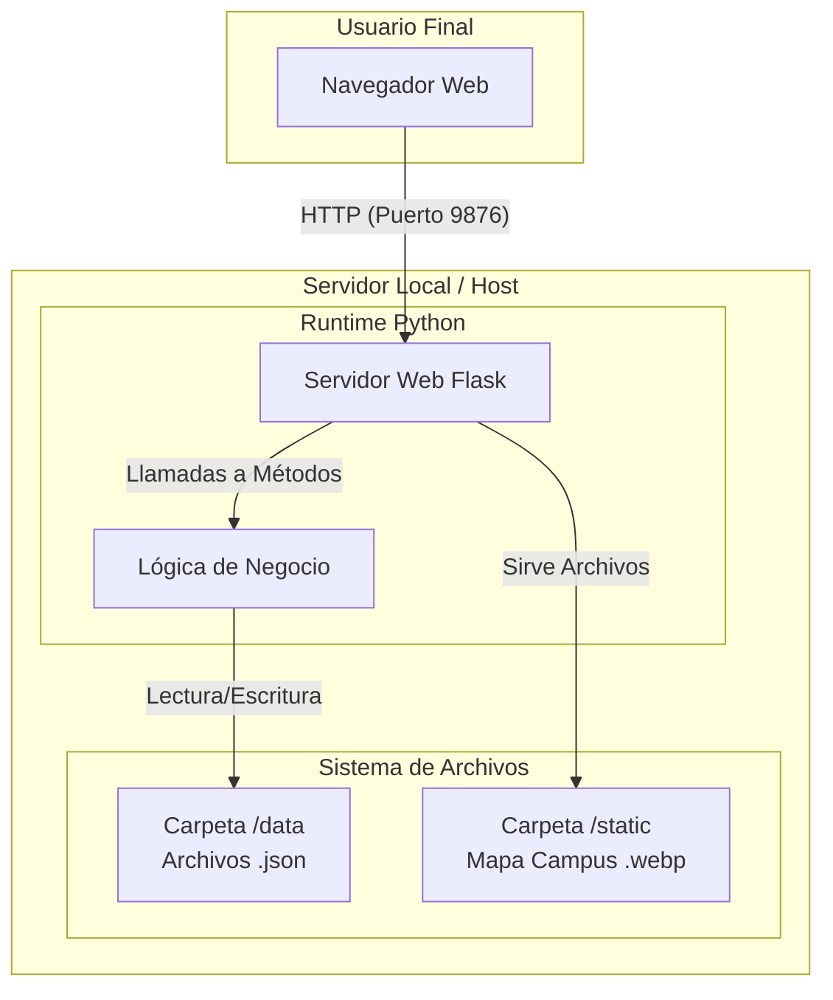

# Diagrama de Despliegue

```mermaid
graph TD
    subgraph Usuario["Usuario Final"]
        Browser[Navegador Web]
    end

    subgraph Servidor["Servidor Local / Host"]
        subgraph Entorno["Runtime Python"]
            Flask[Servidor Web Flask]
            Logic[Lógica de Negocio]
        end
        
        subgraph Almacenamiento["Sistema de Archivos"]
            Data[Carpeta /data<br/>Archivos .json]
            Static[Carpeta /static<br/>Mapa Campus .webp]
        end
    end

    Browser -- "HTTP (Puerto 9876)" --> Flask
    Flask -- "Llamadas a Métodos" --> Logic
    Logic -- "Lectura/Escritura" --> Data
    Flask -- "Sirve Archivos" --> Static
```

